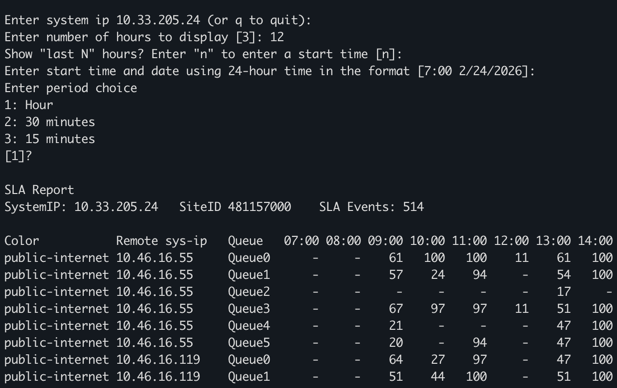
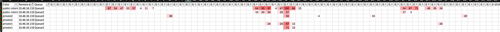
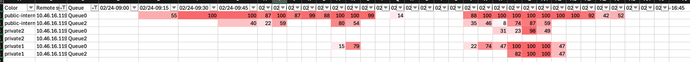

# Cisco SDWAN SLA Reporting Tool

## Overview
The goal of this tool is to view historical information around SDWAN Tunnel SLA and what traffic
classes are out of SLA over time.

The report works by pulling SLA Events from the event log from the selected edge for the selected
time period.  For multi-BFD tunnels the report displays the percentage of time that an SLA class
is removed from a tunnel for each time period.

The script will also generate a CSV. Here's an example of using Excel and applying conditional formatting with the default
"high is bad" format and filtering down to compare Queue0 and Queue2 on 3 colors on a specific tunnel
with a report run across 3 days (72 hours).

Here's another report on the same date with 15 minute intervals on the middle day shown above.

## Installation
> git clone https://github.com/dbrown92700/SDWAN_SLA \
> python -m venv venv \
> pip install -r requirements

Create a .env file using .env_sample.  Edit variables in .env for your environment.

> cp .env_sample .env

## Execute

> python sla_report.py
